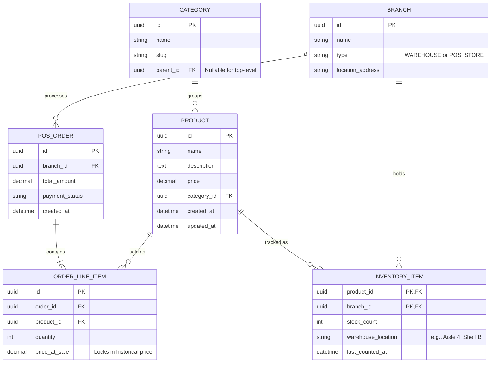
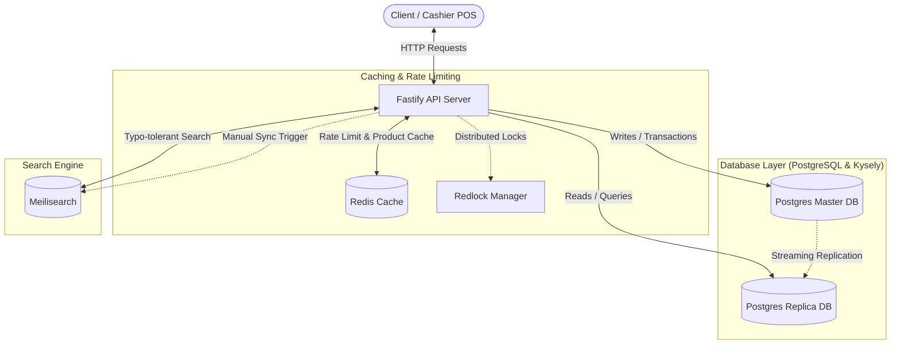

# Catalog Engine
## Preliminary

## Tech Stack

## Key Feature

## ER Diagram

---

## 1. System Architecture Diagram

The Catalog Engine utilizes a high-performance, resilient, and multi-tiered stack designed for sub-millisecond lookups at the point of sale (POS).

### Components Summary
- **Fastify API Server**: Handles routing, validation (TypeBox), and serialization.
- **Redis Cache**: Holds cached product details (`product:<id>`) and handles rate limiting keys.
- **Redlock Manager**: Coordinates distributed locks across Fastify instances to prevent cache stampedes.
- **Postgres Master DB**: The source of truth for all write/administrative mutations.
- **Postgres Replica DB**: Handles all high-volume read lookups to isolate transactional traffic from cashier requests.
- **Meilisearch**: Powers ultra-fast typo-tolerant search specifically optimized for cashier barcode/text entry lookups.

## Endpoints

### Simple Master Data vs. Search Indexing

* **Master Data (Postgres):** CRUD operations for categories, products, and barcodes alter core relational entities in the database. Later specified into separate `read` and `write` database.
* **Search Engine Sync:** High-performance discovery and dynamic filtering are decoupled from standard CRUD via an asynchronous indexing pipeline (Meilisearch).

### Base Catalog

#### Categories

| Method | Endpoint | Description |
| --- | --- | --- |
| `GET` | `/api/categories` | List all product categories (hierarchical) |
| `GET` | `/api/categories/:id` | View specific category details |
| `POST` | `/api/categories` | Create a new category |
| `PATCH` | `/api/categories/:id` | Update a category |
| `DELETE` | `/api/categories/:id` | Delete a category |

#### Products

| Method | Endpoint | Description |
| --- | --- | --- |
| `GET` | `/api/products` | List all base products |
| `GET` | `/api/products/:id` | View a specific product's details and variants |
| `POST` | `/api/products` | Create a new product |
| `PATCH` | `/api/products/:id` | Update base product details |
| `DELETE` | `/api/products/:id` | Delete a product |

#### Barcodes

| Method | Endpoint | Description |
| --- | --- | --- |
| `GET` | `/api/products/:id/barcodes` | List all barcodes attached to a specific product |
| `POST` | `/api/products/:id/barcodes` | Add a new barcode to a product |
| `DELETE` | `/api/products/:id/barcodes/:barcode` | Remove a specific barcode |

#### Search & Discovery

| Method | Endpoint | Description |
| --- | --- | --- |
| `GET` | `/api/facets` | Retrieve available dynamic filters (categories, sizes, colors) for the frontend |
| `GET` | `/api/search` | Execute a search query against the catalog |
| `POST` | `/api/system/search/sync` | Trigger a manual index sync (e.g., pushing Postgres data to Elasticsearch/Typesense/Meilisearch) |
